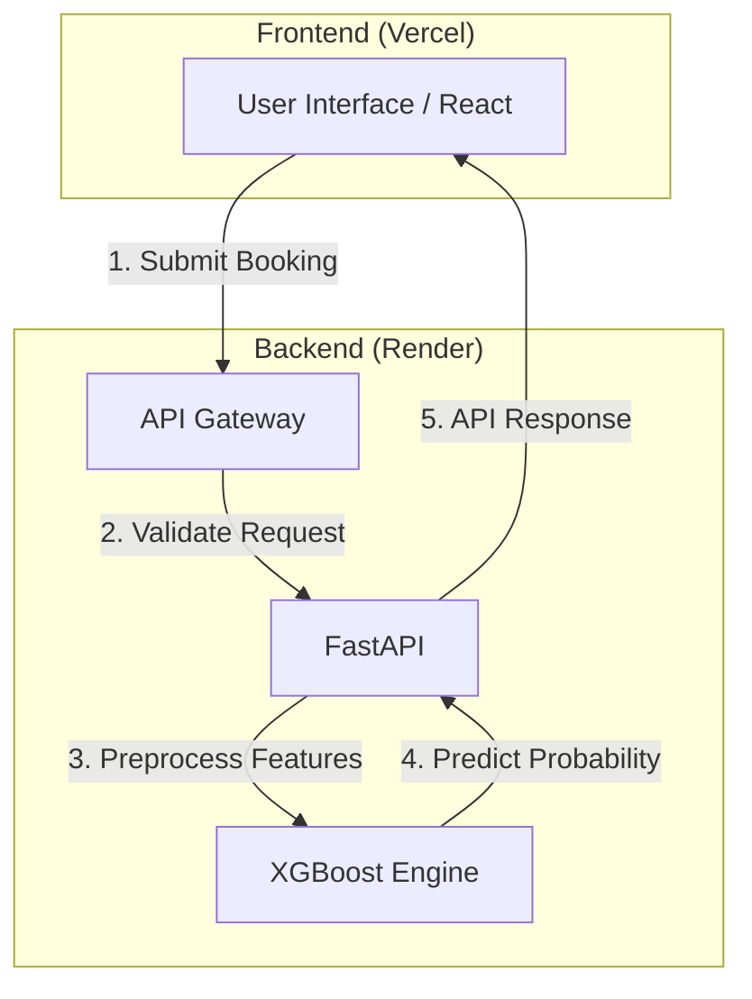
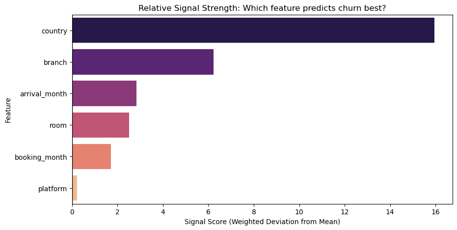

# PlsCheckIn: Hotel No-Show Prediction System
---
**PlsCheckIn** is an end-to-end machine learning application designed to predict the likelihood of hotel guest no-shows. By analyzing booking data, the system provides probability scores and actionable insights to help hotel managers optimize occupancy and revenue.

<div align="center">
  <br>

  
  
  <br><br>

  
  
  <br><br>
</div>

---

## 1. Pipeline Design & Architecture

The system follows a microservices-inspired architecture, separating the User Interface, API Logic, and Inference Engine.

### System Flowchart


### System Flow
1.  **Data Acquisition:** User inputs booking details via the **React** frontend.
2.  **API Gateway:** The data is sent via REST API to the **FastAPI** backend hosted on Render.
3.  **Data Preprocessing:** The raw input is passed through a cleaning and transformation pipeline (Pandas/Scikit-Learn) to match the model's training schema.
4.  **Inference Engine:** A tuned **XGBoost Classifier** predicts the probability of a "No-Show."
5.  **GenAI Interpretation:** An LLM-based agent analyzes the feature importance to explain *why* the prediction was made.
6.  **Response:** The prediction ("Check-In" or "No-Show") and probability score are returned to the user.

### Tech Stack
* **Frontend:** React (Create React App), Tailwind CSS (Deployed on Vercel)
* **Backend:** Python, FastAPI, Uvicorn (Deployed on Render)
* **Machine Learning:** XGBoost, Scikit-Learn, Pandas, Joblib
* **Database:** SQLite (for training data storage)
* **DevOps:** Git, Render & Vercel (Automated CI/CD)

---

## 2. Notebook Findings: EDA & Data Cleaning
During the Exploratory Data Analysis (EDA) phase (notebooks/01_eda.ipynb), several data quality issues were identified and resolved in the cleaning pipeline (src/preprocessing.py).

**Key Findings & Anomalies**
* **Inconsistent Formatting:** arrival_month contained mixed casing (e.g., ApRiL, OcTobeR), which duplicated categories.
* **Currency Mixing:** The price column contained non-numeric symbols and mixed currencies (SGD$ 492.98, USD$ 665.37).
* **Text in Numeric Fields:** Columns like num_adults contained text representations (e.g., "one", "two") instead of integers.
* **Missing Data:** Significant gaps were found in room and price columns which required imputation strategies based on logical groupings.
**Cleaning & Engineering Strategies**
To address these issues, the pipline implements the following transformations: 

| Issue | Resolution Strategy | Source Code (`preprocessing.py`) |
| :--- | :--- | :--- |
| **Mixed Casing** | Normalized all months to **Title Case** (e.g., `ApRiL` $\to$ `April`) to ensure consistent seasonality encoding. | `df[col].astype(str).str.title()` |
| **Currency** | Detected `USD` entries using regex and applied a **1.35x exchange rate** to standardize all prices to SGD. | `df['price'] * 1.35` |
| **Text-to-Number** | Mapped text values (`"one"`, `"two"`) to integers using a dictionary lookup. | `word_map = {'one': 1, ...}` |
| **Missing Prices** | Imputed missing prices using the **Median Price per Room Type** to preserve price variance between luxury and standard rooms. | `groupby('room')['price'].transform('median')` |
| Feature Engineering | Created `lead_time_month` (Booking vs Arrival diff) and `booking_type` bins (LastMinute/EarlyBird) to capture planning behavior. | `(arr - book) % 12` |
| **Noise Removal** | Dropped features (`platform`, `num_adults`, `num_children`) after combining them into `total_guests` to reduce dimensionality. | `df.drop(columns=cols_to_drop)` |


## 3. Feature Engineering Process

To ensure high model accuracy, raw booking data undergoes rigorous engineering before training:

* **Categorical Encoding:** High-cardinality variables (e.g., `country`, `market_segment`) are transformed using One-Hot Encoding to make them machine-readable without imposing ordinal relationships.
* **Temporal Features:** Dates are decomposed into cyclic features (`arrival_month`, `arrival_day`, `lead_time`) to capture seasonality and booking trends.
* **Data Cleaning:** Handling missing values and removing outliers in `adr` (Average Daily Rate) to prevent skewed predictions.
* **Feature Selection:** The pipeline utilizes Feature Importance extraction to prioritize variables that most strongly correlate with cancellation behavior (e.g., *Lead Time* and *Previous Cancellations*).

**Data Insights**

Below is the distribution of No-Shows and the correlation with Lead Time, identified during the EDA phase:


To validate the model's logic and performance, the top driving factors and error rate was analysed. 

### Feature Importance Ranking
Analysis of the "Signal Score" reveals that guest origin and hotel branch are the strongest predictors of no-shows, while the booking platform is statistically insignificant.

| Rank | Feature | Signal Score (MAD) | Impact Level |
| :--- | :--- | :--- | :--- |
| 1 | **Country** | 15.95 |  Critical |
| 2 | **Branch** | 6.23 |  High |
| 3 | **Arrival Month** | 2.84 | Moderate |
| 4 | **Room** | 2.52 |  Moderate |
| 5 | **Booking Month** | 1.72 |  Moderate |
| 6 | *Platform* | *0.23* |  Negligible (Dropped) |




---

## 4. Model Evaluation & Metrics

The core model is an **XGBoost Classifier** (Extreme Gradient Boosting), selected for its superior performance on structured tabular data and efficient handling of sparse features.

### Key Metrics
* **Target Metric:** **F1-Score (0.67)**. Accuracy alone is misleading because "Check-Ins" often outnumber "No-Shows." The F1-score ensures a balance between Precision (accuracy of "No-Show" predictions) and Recall (ability to catch all actual "No-Shows").
* **Performance:** The model currently achieves a Test F1-Score of 0.6739.
* **Threshold Tuning:** Instead of the default `0.5` decision boundary, the model uses a **Dynamic Threshold** (Optimsied to 0.52).
    * *Logic:* This tuning will maximise the detection rate of cancellations while maintaining precision. 


---

## 5. Quality Assurance (QA) Report

This project underwent rigorous testing to ensure stability in a production environment. Below is a summary of the technical challenges resolved:

### Deployment & Infrastructure
* **Memory Optimization (OOM Fix):**
    * *Issue:* The initial model file exceeded Render's 512MB RAM limit, causing server crashes on startup.
    * *Resolution:* Optimized the serialization process and feature set, reducing the model artifact from **1GB** to **2.8MB**, ensuring instant startup and low latency.
* **Frontend Build Configuration:**
    * *Issue:* The build process failed in the Vercel CI/CD environment due to incorrect path resolution (Error 127).
    * *Resolution:* Configured the correct **Root Directory** (`frontend/`) in the deployment settings to ensure dependencies were installed and built correctly.

### Security & Connectivity
* **CORS (Cross-Origin Resource Sharing):**
    * *Issue:* The backend blocked API requests from Vercel's dynamic Preview URLs.
    * *Resolution:* Implemented specific Regex Middleware in FastAPI (`allow_origin_regex`) to securely accept requests from any `*.vercel.app` domain while blocking unauthorized external traffic.

---

## 6. Live Demo & Access 
The application is deployed and accessible online without local installation: 

* **Frontend Application:** https://plscheckin.vercel.app
* **Backend API:** https://plscheckin.onrender.com/ (Hosted on Render and auto-connects to the frontend)


## 7. How to Run Locally

**Prerequisites:**
* Python 3.10+
* Node.js & npm

**1. Install Backend Dependencies**
You need to install the Python packages located in the `backend` folder.
```bash
cd backend
pip install -r requirements.txt
```

**2. Start the App**
* Run the helper script to launch both the backend and frontend locally. 

```bash 
chmod +x run.sh # This is to make the script executable, for Mac/Linux only
./run.sh
```

**To Access the Application:**
* Backend: http://localhost:8000
* Frontend: http://localhost:3000


