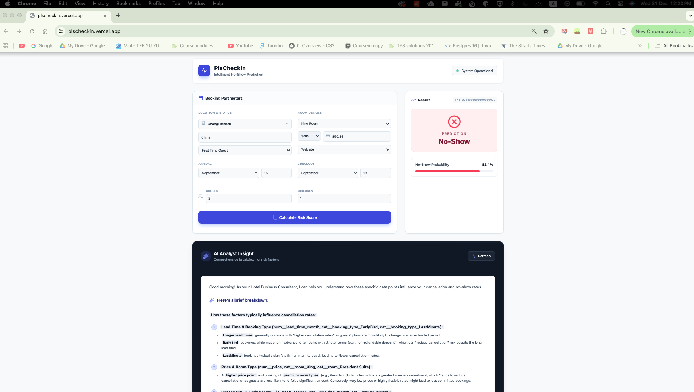
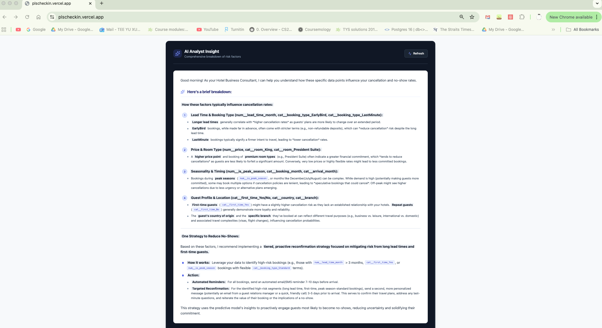
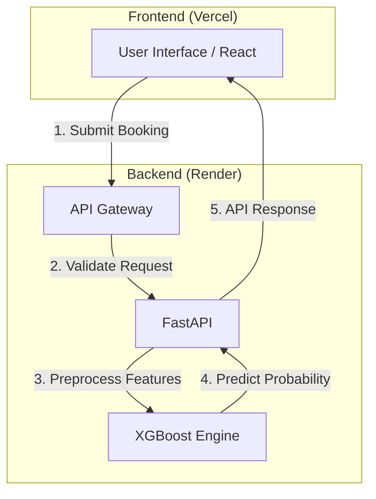
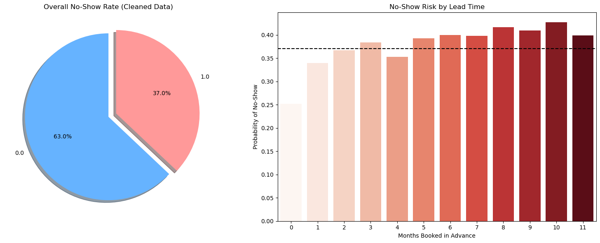

# PlsCheckIn: Hotel No-Show Prediction System

**PlsCheckIn** is an end-to-end machine learning application designed to predict the likelihood of hotel guest no-shows. By analyzing booking data, the system provides probability scores and actionable insights to help hotel managers optimize occupancy and revenue.

<div align="center">
  <h1>PlsCheckIn: Hotel No-Show Prediction System</h1>
  
  <p>
    <strong>Predict No-Shows. Optimize Revenue.</strong>
  </p>
  
  <p>
    An end-to-end machine learning application designed to predict the likelihood of hotel guest no-shows. <br>
    By analyzing booking data, the system provides probability scores and actionable insights.
  </p>

  <br>

  <p align="center">
    
    &nbsp; &nbsp; &nbsp; &nbsp;
    
  </p>
  
  <br>
</div>

---

## 1. Pipeline Design & Architecture

The system follows a microservices-inspired architecture, separating the User Interface, API Logic, and Inference Engine.

### System Flowchart


### System Flow
1.  **Data Acquisition:** User inputs booking details via the **React** frontend.
2.  **API Gateway:** The data is sent via REST API to the **FastAPI** backend hosted on Render.
3.  **Data Preprocessing:** The raw input is passed through a cleaning and transformation pipeline (Pandas/Scikit-Learn) to match the model's training schema.
4.  **Inference Engine:** A tuned **XGBoost Classifier** predicts the probability of a "No-Show."
5.  **GenAI Interpretation:** An LLM-based agent analyzes the feature importance to explain *why* the prediction was made.
6.  **Response:** The prediction ("Check-In" or "No-Show") and probability score are returned to the user.

### Tech Stack
* **Frontend:** React (Create React App), Tailwind CSS (Deployed on Vercel)
* **Backend:** Python, FastAPI, Uvicorn (Deployed on Render)
* **Machine Learning:** XGBoost, Scikit-Learn, Pandas, Joblib
* **Database:** SQLite (for training data storage)
* **DevOps:** Git, Render & Vercel (Automated CI/CD)

---

## 2. Feature Engineering Process

To ensure high model accuracy, raw booking data undergoes rigorous engineering before training:

* **Categorical Encoding:** High-cardinality variables (e.g., `country`, `market_segment`) are transformed using One-Hot Encoding to make them machine-readable without imposing ordinal relationships.
* **Temporal Features:** Dates are decomposed into cyclic features (`arrival_month`, `arrival_day`, `lead_time`) to capture seasonality and booking trends.
* **Data Cleaning:** Handling missing values and removing outliers in `adr` (Average Daily Rate) to prevent skewed predictions.
* **Feature Selection:** The pipeline utilizes Feature Importance extraction to prioritize variables that most strongly correlate with cancellation behavior (e.g., *Lead Time* and *Previous Cancellations*).

---

## 3. Model Evaluation & Metrics

The core model is an **XGBoost Classifier** (Extreme Gradient Boosting), selected for its superior performance on structured tabular data and efficient handling of sparse features.

### Key Metrics
* **Target Metric:** **F1-Score**. Accuracy alone is misleading because "Check-Ins" often outnumber "No-Shows." The F1-score ensures a balance between Precision (accuracy of "No-Show" predictions) and Recall (ability to catch all actual "No-Shows").
* **Threshold Tuning:** Instead of the default `0.5` decision boundary, the model uses a **Dynamic Threshold** (e.g., `0.35`).
    * *Logic:* It is safer to flag a potential "No-Show" early than to miss it. This tuning maximizes the detection rate of cancellations.

**Data Insights**

Below is the distribution of No-Shows and the correlation with Lead Time, identified during the EDA phase:


---

## 4. Quality Assurance (QA) Report

This project underwent rigorous testing to ensure stability in a production environment. Below is a summary of the technical challenges resolved:

### Deployment & Infrastructure
* **Memory Optimization (OOM Fix):**
    * *Issue:* The initial model file exceeded Render's 512MB RAM limit, causing server crashes on startup.
    * *Resolution:* Optimized the serialization process and feature set, reducing the model artifact from **1GB** to **2.8MB**, ensuring instant startup and low latency.
* **Frontend Build Configuration:**
    * *Issue:* The build process failed in the Vercel CI/CD environment due to incorrect path resolution (Error 127).
    * *Resolution:* Configured the correct **Root Directory** (`frontend/`) in the deployment settings to ensure dependencies were installed and built correctly.

### Security & Connectivity
* **CORS (Cross-Origin Resource Sharing):**
    * *Issue:* The backend blocked API requests from Vercel's dynamic Preview URLs.
    * *Resolution:* Implemented specific Regex Middleware in FastAPI (`allow_origin_regex`) to securely accept requests from any `*.vercel.app` domain while blocking unauthorized external traffic.

---

## 5. How to Run Locally

**Prerequisites:**
* Python 3.10+
* Node.js & npm

**1. Install Backend Dependencies**
```bash
pip install -r requirements.txt
```

**2. Start the App**
* Run the helper script to launch both the backend and frontend locally. 

```bash 
chmod +x run.sh # This is to make the script executable, for Mac/Linux only
./run.sh
```

**To Access the Application:**
* Backend: http://localhost:8000
* Frontend: http://localhost:3000


